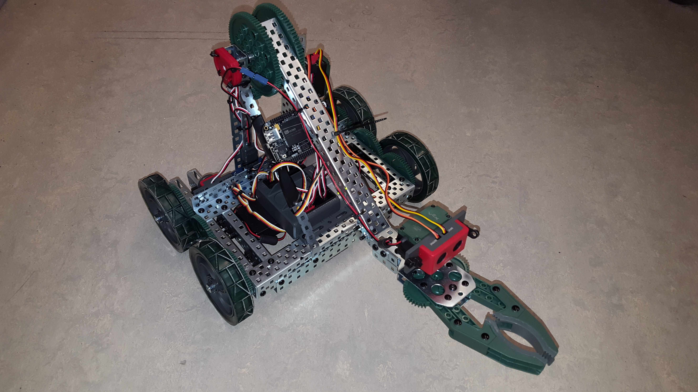
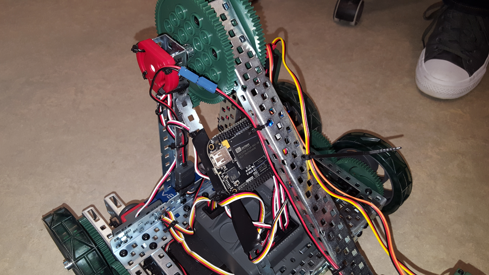
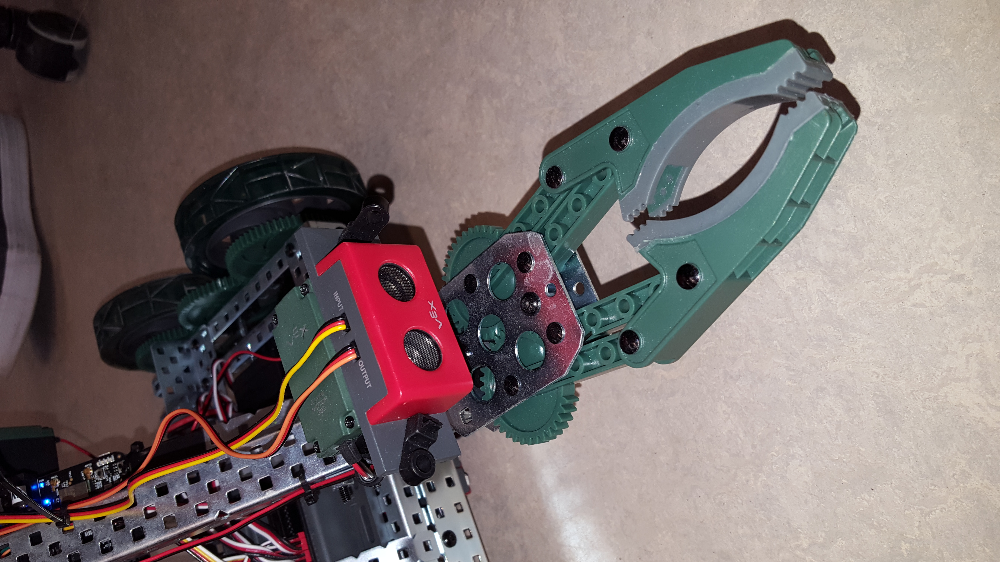

# Decepticon Communication Software

**Description**: A TCP/IP application written in C++ designed to interface with and remotely control a robot to perform various tasks. These tasks included the ability to drive in all directions; raise or lower the front-facing arm or open and close the mounted claw. Real-time communication both to and from the robot was possible by implementing multiple threads which sent commands and received data (which varied from command acknowledgements to telemetry sensor data).

**Project Photos**:

