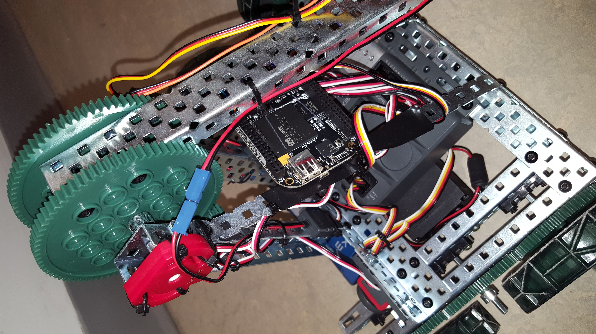

# Decepticon Communication Software 

**Description**: A TCP/IP application written in C++ designed to interface with and remotely control a robot designed by [Dr. Elliot Coleshill](https://github.com/ecoleshill). Commands included the ability to drive in all directions, raise or lower the front-facing arm and open or close the mounted claw. Real-time communication both to and from the robot was possible by implementing multiple threads which opened a bidirectional channel for robot commands or telemetry data.

**Team Members**: [Sean Prashad](https://github.com/SeanPrashad), [Hao Chen](https://github.com/haoRchen) and [Stephen Noble](https://github.com/hsnoble)

**Project Video**:

**Project Photos**:

